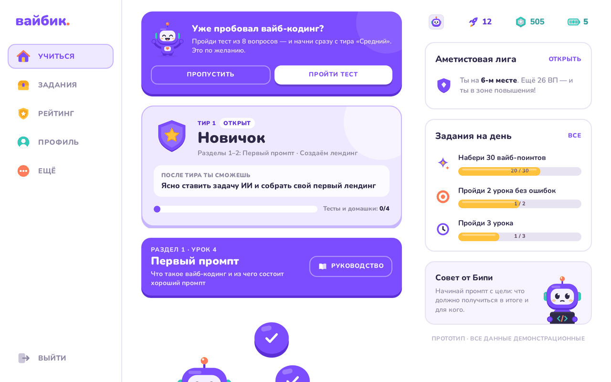
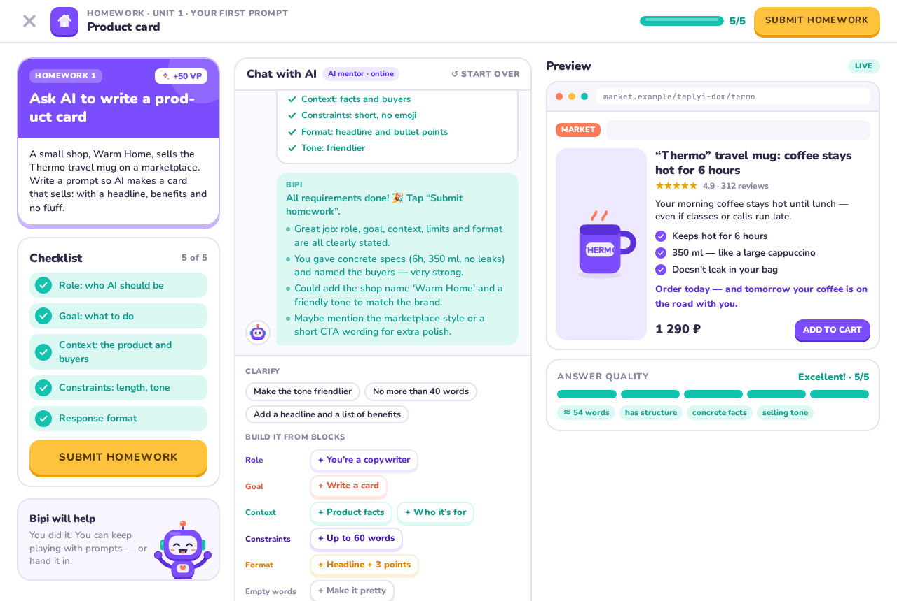
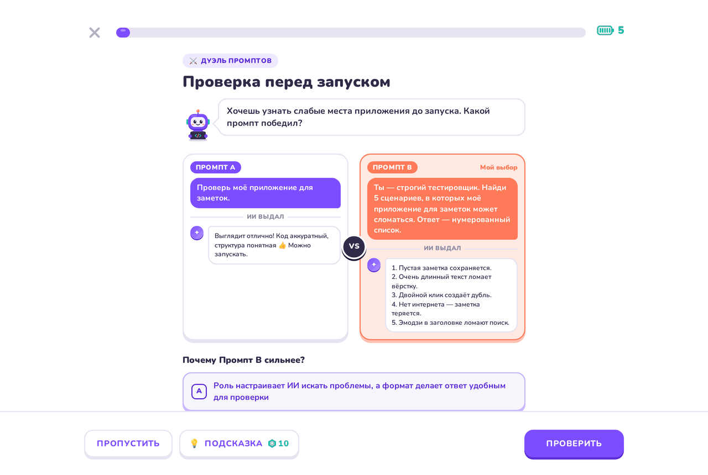
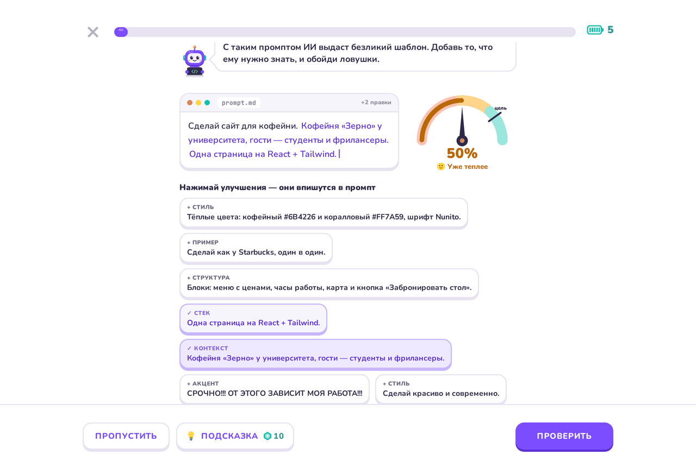
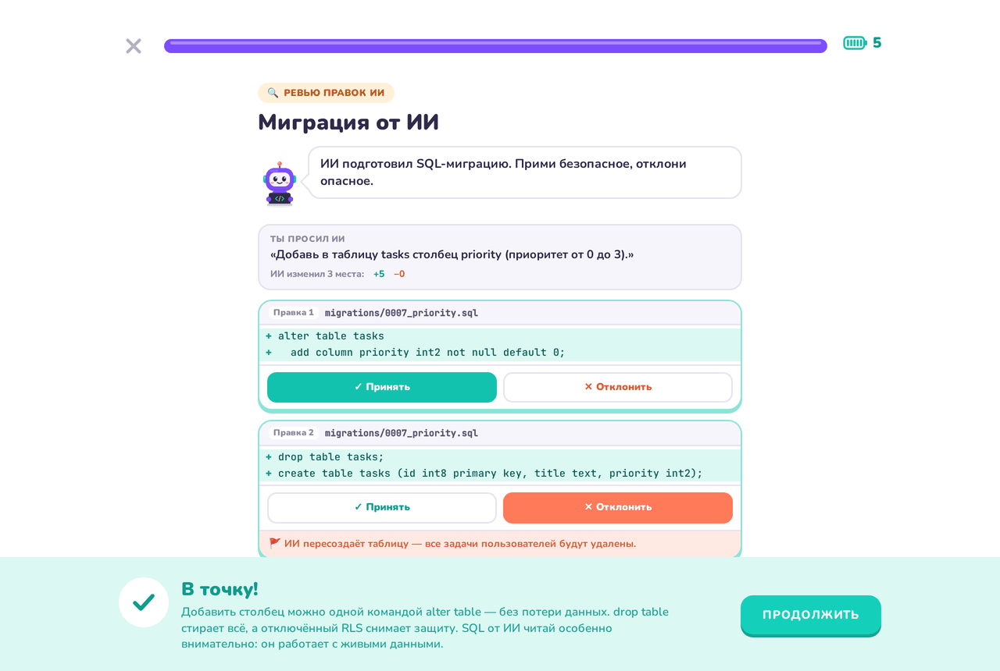
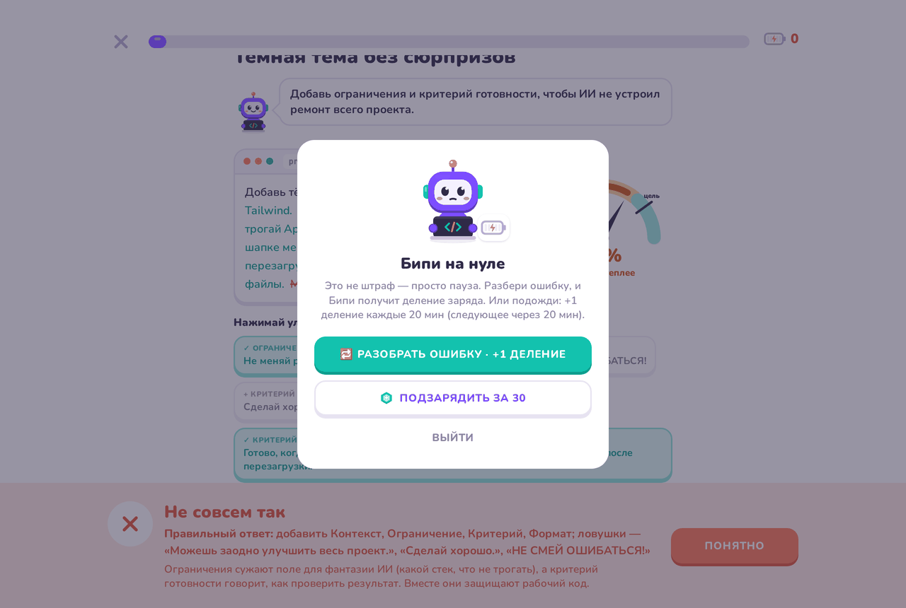
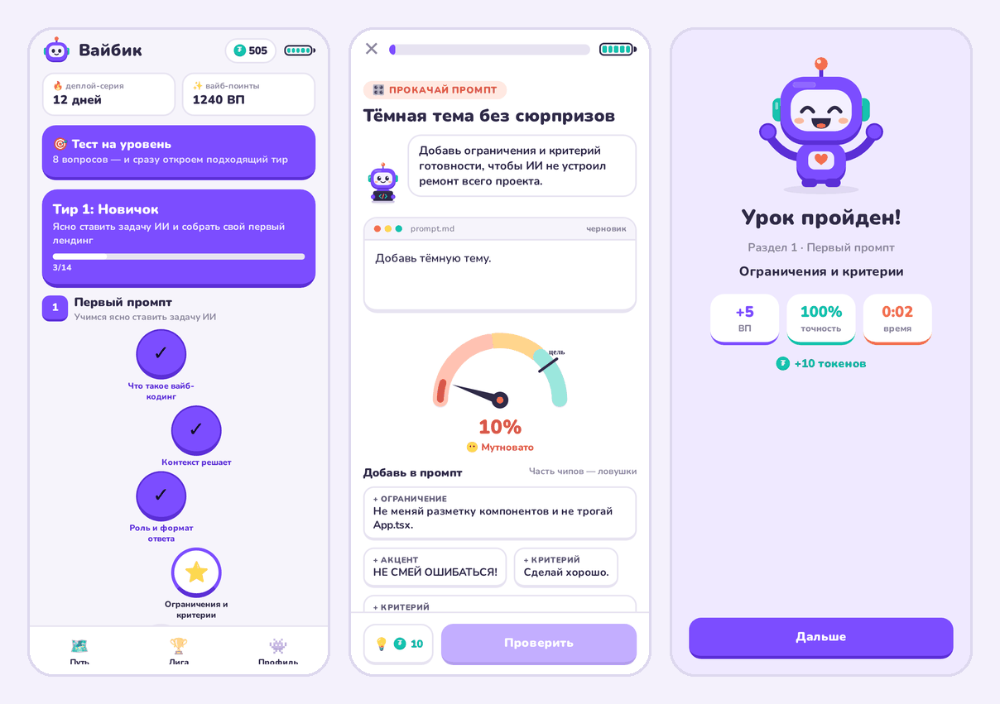
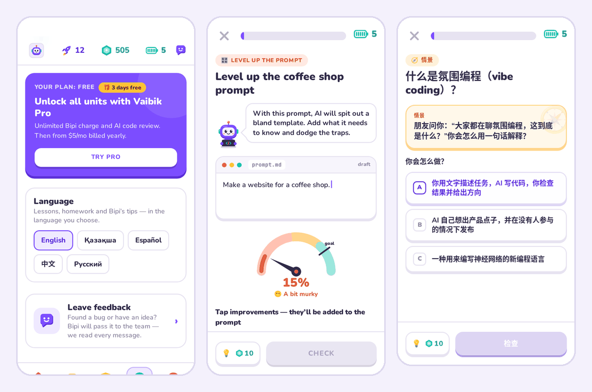

# Вайбик

> **EN:** Vaibik is a Duolingo-style course that teaches vibe coding — building software by talking to AI — in 5-minute lessons, on the web and on iOS/Android.

**Вайбик** — обучающее приложение про **вайб-кодинг**: как создавать сайты и приложения, ставя задачи ИИ
(Cursor, Claude, ChatGPT, v0, Lovable, Bolt). Уроки по 3–5 минут, фирменные типы упражнений,
мини-проекты с проверкой ИИ и маскот Бипи. Веб-версия и мобильное приложение (iOS / Android) работают
на одном и том же контенте.

<p align="center">
  
</p>

<table>
  <tr>
    <td width="50%"><br><sub><b>Путь обучения</b> — 3 тира, 5 разделов, 30 уроков и 5 домашек</sub></td>
    <td width="50%"><br><sub><b>Домашка</b> — промпт, чек-лист, разбор ИИ и живое превью</sub></td>
  </tr>
  <tr>
    <td><br><sub><b>Дуэль промптов</b> — какой промпт сработал лучше и почему</sub></td>
    <td><br><sub><b>Прокачай промпт</b> — улучшения и ловушки, Вайб-метр</sub></td>
  </tr>
  <tr>
    <td><br><sub><b>Ревью правок ИИ</b> — принять или отклонить каждый кусок диффа</sub></td>
    <td><br><sub><b>Заряд Бипи</b> — ошибка — это пауза, а не штраф</sub></td>
  </tr>
  <tr>
    <td><br><sub><b>Мобильное приложение</b> (Expo / React Native)</sub></td>
    <td><br><sub><b>5 языков</b>: русский, English, қазақша, español, 中文</sub></td>
  </tr>
</table>

## Возможности

- **Курс:** 3 тира (Новичок · Средний · Продвинутый), 5 разделов — первый промпт, лендинг, отладка с ИИ,
  данные и бэкенд, запуск. 30 уроков (156 упражнений) и 5 домашек. «Тест на уровень» открывает тир сразу.
- **8 типов упражнений:** ⚔️ дуэль промптов · 🔮 предскажи результат · 🎛️ прокачай промпт · 💬 следующий ход ·
  🔍 ревью правок ИИ · 🐞 найди баг / 🚩 красный флаг · 🛤️ собери пайплайн · 🧭 ситуация.
  У каждого ответа есть объяснение «почему».
- **Домашки — мини-проекты:** карточка товара, лендинг кофейни, починка бага, форма с базой данных, деплой.
  Промпт пишется текстом или собирается из блоков; результат сразу видно в превью. Проверка — ИИ на сервере,
  без сети — офлайн-симулятор.
- **Экономика без «жизней»:** заряд Бипи (5 делений, +1 каждые 20 минут), токены за уроки (подсказка — 10,
  полная подзарядка — 30), деплой-серия, вайб-поинты, лига.
- **Языки:** интерфейс, курс и домашки на 5 языках.
- **Pro:** Free — раздел 1 целиком и «Тест на уровень»; Pro — $9.99/мес или $59.99/год, 3 дня бесплатно.
- **Отзывы, аналитика, ошибки:** лист «Отзыв» и микро-опросы, PostHog и Sentry — без личных данных.
- **Демо-режим:** без ключей и сервера всё работает в браузере — вход по любому email.

## Технологии

| Часть | Стек |
|---|---|
| Веб | Vite 8, React 19, TypeScript, Tailwind CSS v4 |
| Мобилка | Expo SDK 57, React Native, expo-router, Reanimated |
| Бэкенд | Vercel Functions (Node.js 22/24), Supabase (Auth, Postgres, RLS) |
| ИИ | DeepSeek — только на сервере, через `/api/ai/review` |
| Оплата | Polar (веб), RevenueCat (App Store / Google Play) |
| Наблюдаемость | PostHog, Sentry |
| Качество | Vitest, oxlint, Playwright, валидаторы контента |

## Структура проекта

```
vibe-app/
├── src/                 веб-приложение
│   ├── data/            контент курса и чистая логика (общая с мобилкой)
│   ├── homework/        симуляторы домашек и превью
│   ├── i18n/            UI-каталоги и переводы курса
│   ├── components/      UI; exercises/ — 8 типов упражнений
│   ├── screens/         экраны
│   └── lib/             конфиг, Supabase, синхронизация, ИИ, оплата, аналитика
├── api/                 Vercel Functions (/api/*)
├── server/              логика функций
├── supabase/            миграции и тесты RLS
├── mobile/              мобильное приложение (Expo)
├── tests/               unit-тесты (vitest)
├── scripts/
│   ├── validate/        проверки контента, домашек и переводов
│   ├── e2e/             сквозное прохождение курса (Playwright)
│   └── shots/           скриншоты → .artifacts/screenshots/
├── docs/                документация и картинки README
├── SETUP.md             запуск в прод по шагам
└── .env.example         все переменные окружения
```

Подробнее — [docs/ARCHITECTURE.md](docs/ARCHITECTURE.md).

## Быстрый старт

Нужен **Node.js 22.12 или новее** (рекомендуем актуальный LTS с [nodejs.org](https://nodejs.org)).

```bash
git clone https://github.com/linee64/vibe-app.git
cd vibe-app
npm install
npm run dev
```

Откройте **http://localhost:5173**, нажмите «Начать бесплатно» и введите любой email и пароль —
это демо-режим, ничего никуда не отправляется. Подключение Supabase, ИИ, оплаты, аналитики и деплой на Vercel —
пошагово в **[SETUP.md](SETUP.md)**.

Мобильное приложение: `cd mobile && npm install && npx expo start` — подробности в
**[mobile/README.md](mobile/README.md)**, публикация в сторы — в [mobile/SETUP-MOBILE.md](mobile/SETUP-MOBILE.md).

## Скрипты

| Команда | Что делает |
|---|---|
| `npm run dev` | dev-сервер на http://localhost:5173 |
| `npm run build` | проверка типов и production-сборка в `dist/` |
| `npm run preview` | раздача собранной версии на http://localhost:4173 |
| `npm run lint` | линтер oxlint |
| `npm test` | unit-тесты (vitest): функции `/api`, слияние прогресса, i18n, мост ИИ → симулятор |
| `npm run validate` | все проверки без браузера: `validate:content`, `validate:homework`, `validate:i18n` |
| `npm run e2e -- [url] [--desktop]` | Playwright проходит весь курс: тиры, тест на уровень, 30 уроков, 5 домашек, экономика |
| `npm run e2e:i18n -- [url]` | смоук языка (`VAIBIK_LANG=en\|kk\|es\|zh`) |
| `npm run shots -- [url]` | скриншоты веб-версии в `.artifacts/screenshots/` |
| `npm run shots:mobile -- [url]` | скриншоты мобилки через Expo web |

Для `e2e` и `shots` нужен запущенный сайт и браузер Playwright (`npx playwright install chromium`);
адрес по умолчанию — `http://localhost:5173`. Сквозной прогон проверяет закрытые тиры и пейвол, поэтому
запускайте его на сборке без режима ревью:

```bash
VITE_REVIEW_MODE=false npm run build && npm run preview   # http://localhost:4173
npm run e2e -- http://localhost:4173                       # в соседнем терминале
```

## Документация

- [SETUP.md](SETUP.md) — Supabase, DeepSeek, Vercel, Polar, PostHog, Sentry, отзывы; все переменные окружения.
- [docs/ARCHITECTURE.md](docs/ARCHITECTURE.md) — папки, поток данных, демо-режим, общий код веба и мобилки.
- [docs/analytics.md](docs/analytics.md) — события и воронка PostHog.
- [docs/i18n-glossary.md](docs/i18n-glossary.md) — глоссарий переводов.
- [mobile/README.md](mobile/README.md), [mobile/SETUP-MOBILE.md](mobile/SETUP-MOBILE.md) — мобильное приложение.

## Если что-то не работает

- **Ошибка версии Node.js** (`EBADENGINE`, `Vite requires Node.js…`) — обновите Node.js до LTS, удалите
  `node_modules` и снова выполните `npm install`.
- **Порт 5173 занят** — Vite возьмёт следующий свободный; адрес смотрите в строке `Local:`.
- **Открыть на телефоне** — телефон и компьютер в одной Wi-Fi сети, адрес из строки `Network:`.
- **Сбросить прогресс** — «Профиль → Сбросить демо-прогресс» или удалите ключи `vaibik.*` в Local Storage.
